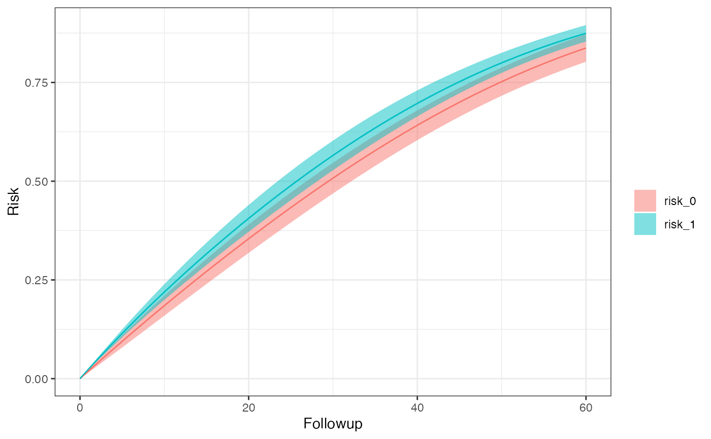
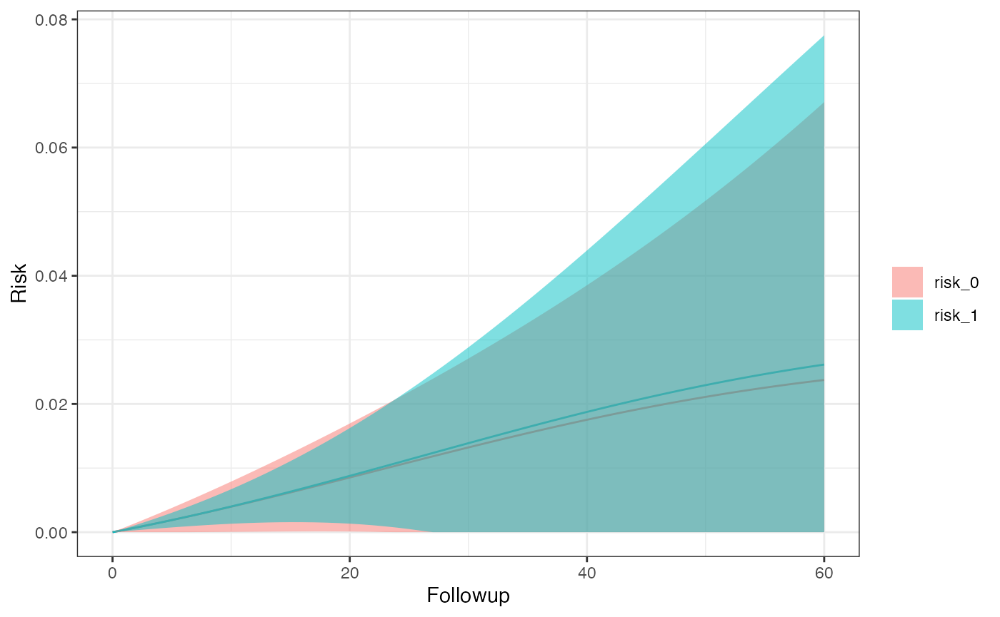
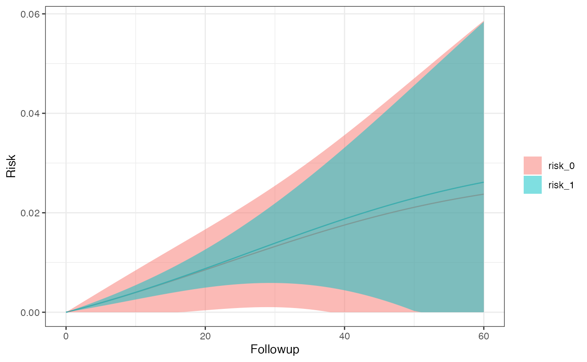
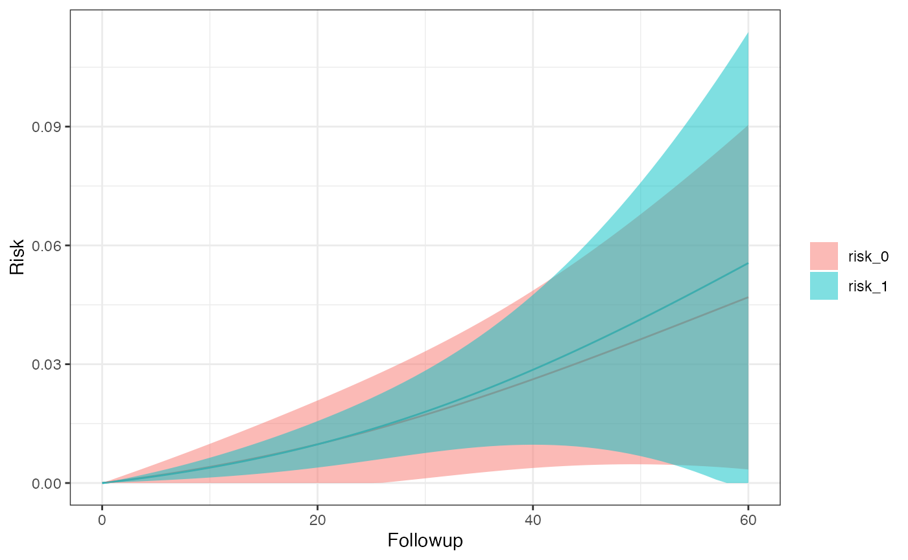
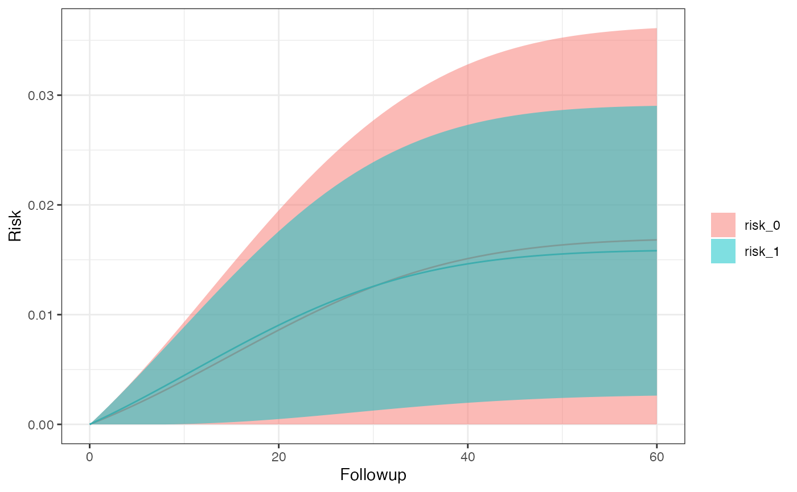

# Intention-To-Treat Analysis

Here, we’ll go over some examples of using ITT. First we need to load
the library before getting in to some sample use cases.

``` r

library(SEQTaRget)
```

## ITT With 5 bootstrap samples

``` r

options <- SEQopts(# tells SEQuential to create Kaplan-Meier curves
                   km.curves = TRUE,
                   # tells SEQuential to bootstrap
                   bootstrap = TRUE,
                   # tells SEQuential to run bootstraps 5 times
                   bootstrap.nboot = 5)

# use example data
data <- SEQdata                             
model <- SEQuential(data, id.col = "ID", 
                          time.col = "time", 
                          eligible.col = "eligible", 
                          treatment.col = "tx_init", 
                          outcome.col = "outcome", 
                          time_varying.cols = c("N", "L", "P"), 
                          fixed.cols = "sex",
                          method = "ITT", 
                          options = options)
#> 
#> Full dataset: 12,180 observations, 11 variables
#> 
#> Non-required columns provided, pruning for efficiency
#> 
#> Pruned
#> 
#> Original dataset (eligible subjects): 9,203 observations, 9 variables
#> 
#> Expanding Data...
#> 
#> Pre-filter expansion: 310,080 observations
#> 
#> Expanded dataset: 248,485 observations, 13 variables
#> 
#> Expansion Successful
#> 
#> Final analysis dataset: 248,485 observations, 13 variables
#> 
#> Moving forward with ITT analysis
#> 
#> Bootstrapping with 80% of 300 subjects (240 subjects, ~198,788 observations per resample) 5 times
#> 
#> ITT model created successfully
#> 
#> Creating Survival curves
#> 
#> Completed

km_curve(model, plot.type = "risk")        # retrieve risk plot
```



``` r

risk_data(model)
#> Index: <Followup>
#>    Method Followup      A      Risk   95% LCI   95% UCI         SE
#>    <char>    <num> <char>     <num>     <num>     <num>      <num>
#> 1:    ITT       60      0 0.8372582 0.8023135 0.8722029 0.01782926
#> 2:    ITT       60      1 0.8744359 0.8536001 0.8952717 0.01063070
risk_comparison(model)
#>    Followup    A_x    A_y Risk Ratio RR 95% LCI RR 95% UCI log(RR) SE
#>       <num> <fctr> <fctr>      <num>      <num>      <num>      <num>
#> 1:       60 risk_0 risk_1  1.0444041  1.0231392  1.0661110 0.01049558
#> 2:       60 risk_1 risk_0  0.9574838  0.9379887  0.9773842 0.01049558
#>    Risk Difference  RD 95% LCI  RD 95% UCI       RD SE
#>              <num>       <num>       <num>       <num>
#> 1:      0.03717768  0.02106730  0.05328806 0.008219733
#> 2:     -0.03717768 -0.05328806 -0.02106730 0.008219733
```

## ITT with 5 bootstrap samples and losses-to-followup

``` r

options <- SEQopts(km.curves = TRUE,               
                   bootstrap = TRUE,                
                   bootstrap.nboot = 5,
                   # tells SEQuential to expect LTFU as the censoring column
                   cense = "LTFU",
                   # tells SEQuential to treat this column as the 
                   # censoring eligibility column
                   cense.eligible = "eligible_cense")

# use example data for LTFU
data <- SEQdata.LTFU
model <- SEQuential(data, id.col = "ID", 
                          time.col = "time", 
                          eligible.col = "eligible", 
                          treatment.col = "tx_init", 
                          outcome.col = "outcome", 
                          time_varying.cols = c("N", "L", "P"), 
                          fixed.cols = "sex",
                          method = "ITT", 
                          options = options)
#> 
#> Full dataset: 54,687 observations, 13 variables
#> 
#> Non-required columns provided, pruning for efficiency
#> 
#> Pruned
#> 
#> Original dataset (eligible subjects): 29,624 observations, 11 variables
#> 
#> Expanding Data...
#> 
#> Pre-filter expansion: 1,609,859 observations
#> 
#> Expanded dataset: 1,119,229 observations, 18 variables
#> 
#> Expansion Successful
#> 
#> Final analysis dataset: 1,119,229 observations, 18 variables
#> 
#> Moving forward with ITT analysis
#> 
#> Bootstrapping with 80% of 1,000 subjects (800 subjects, ~895,383 observations per resample) 5 times
#> 
#> ITT model created successfully
#> 
#> Creating Survival curves
#> 
#> Completed

km_curve(model, plot.type = "risk")
```



``` r

risk_data(model)
#> Index: <Followup>
#>    Method Followup      A       Risk 95% LCI    95% UCI         SE
#>    <char>    <num> <char>      <num>   <num>      <num>      <num>
#> 1:    ITT       60      0 0.02374360       0 0.06709029 0.02211606
#> 2:    ITT       60      1 0.02614576       0 0.07751561 0.02620959
risk_comparison(model)
#>    Followup    A_x    A_y Risk Ratio RR 95% LCI RR 95% UCI log(RR) SE
#>       <num> <fctr> <fctr>      <num>      <num>      <num>      <num>
#> 1:       60 risk_0 risk_1  1.1011710  0.6624555   1.830429  0.2592782
#> 2:       60 risk_1 risk_0  0.9081242  0.5463201   1.509535  0.2592782
#>    Risk Difference  RD 95% LCI RD 95% UCI     RD SE
#>              <num>       <num>      <num>     <num>
#> 1:     0.002402164 -0.02220968 0.02701401 0.0125573
#> 2:    -0.002402164 -0.02701401 0.02220968 0.0125573
```

## ITT with 5 bootstrap samples and competing events

``` r

options <- SEQopts(km.curves = TRUE,               
                   bootstrap = TRUE,                
                   bootstrap.nboot = 5,
                   # Using LTFU as our competing event
                   compevent = "LTFU")

data <- SEQdata.LTFU
model <- SEQuential(data, id.col = "ID", 
                          time.col = "time", 
                          eligible.col = "eligible", 
                          treatment.col = "tx_init", 
                          outcome.col = "outcome", 
                          time_varying.cols = c("N", "L", "P"), 
                          fixed.cols = "sex",
                          method = "ITT", 
                          options = options)
#> 
#> Full dataset: 54,687 observations, 13 variables
#> 
#> Non-required columns provided, pruning for efficiency
#> 
#> Pruned
#> 
#> Original dataset (eligible subjects): 29,624 observations, 10 variables
#> 
#> Expanding Data...
#> 
#> Pre-filter expansion: 1,609,859 observations
#> 
#> Expanded dataset: 1,119,229 observations, 14 variables
#> 
#> Expansion Successful
#> 
#> Final analysis dataset: 1,119,229 observations, 14 variables
#> 
#> Moving forward with ITT analysis
#> 
#> Bootstrapping with 80% of 1,000 subjects (800 subjects, ~895,383 observations per resample) 5 times
#> 
#> ITT model created successfully
#> 
#> Creating Survival curves
#> 
#> Completed

km_curve(model, plot.type = "risk")
```



``` r

risk_data(model)
#> Index: <Followup>
#>    Method Followup      A       Risk 95% LCI    95% UCI         SE
#>    <char>    <num> <char>      <num>   <num>      <num>      <num>
#> 1:    ITT       60      0 0.02185652       0 0.05236571 0.01556620
#> 2:    ITT       60      1 0.02381601       0 0.05145809 0.01410336
risk_comparison(model)
#>    Followup    A_x    A_y Risk Ratio RR 95% LCI RR 95% UCI log(RR) SE
#>       <num> <fctr> <fctr>      <num>      <num>      <num>      <num>
#> 1:       60  inc_0  inc_1  1.0896524  0.7371605   1.610697  0.1993957
#> 2:       60  inc_1  inc_0  0.9177239  0.6208492   1.356557  0.1993957
#>    Risk Difference   RD 95% LCI  RD 95% UCI       RD SE
#>              <num>        <num>       <num>       <num>
#> 1:     0.001959489 -0.002191523 0.006110502 0.002117902
#> 2:    -0.001959489 -0.006110502 0.002191523 0.002117902
```

## ITT hazard ratio with 5 bootstrap samples and competing events

``` r

options <- SEQopts(# km.curves must be set to FALSE to turn on hazard 
                   # ratio creation
                   km.curves = FALSE,
                   # set hazard to TRUE for hazard ratio creation
                   hazard = TRUE,
                   bootstrap = TRUE,                
                   bootstrap.nboot = 5,     
                   compevent = "LTFU")

data <- SEQdata.LTFU                          
model <- SEQuential(data, id.col = "ID", 
                          time.col = "time", 
                          eligible.col = "eligible", 
                          treatment.col = "tx_init", 
                          outcome.col = "outcome", 
                          time_varying.cols = c("N", "L", "P"), 
                          fixed.cols = "sex",
                          method = "ITT", 
                          options = options)
#> 
#> Full dataset: 54,687 observations, 13 variables
#> 
#> Non-required columns provided, pruning for efficiency
#> 
#> Pruned
#> 
#> Original dataset (eligible subjects): 29,624 observations, 10 variables
#> 
#> Expanding Data...
#> 
#> Pre-filter expansion: 1,609,859 observations
#> 
#> Expanded dataset: 1,119,229 observations, 14 variables
#> 
#> Expansion Successful
#> 
#> Final analysis dataset: 1,119,229 observations, 14 variables
#> 
#> Moving forward with ITT analysis
#> 
#> Bootstrapping with 80% of 1,000 subjects (800 subjects, ~895,383 observations per resample) 5 times
#> 
#> Completed

# retrieve hazard ratios
hazard_ratio(model)
#> Hazard ratio          LCI          UCI 
#>    1.0854161    0.7877539    1.4955534
```

## ITT with 5 bootstrap samples and competing events in subgroups defined by sex

``` r

options <- SEQopts(km.curves = TRUE,               
                   bootstrap = TRUE,                
                   bootstrap.nboot = 5,     
                   compevent = "LTFU",
                   # define the subgroup
                   subgroup = "sex")

data <- SEQdata.LTFU
model <- SEQuential(data, id.col = "ID", 
                          time.col = "time", 
                          eligible.col = "eligible", 
                          treatment.col = "tx_init", 
                          outcome.col = "outcome", 
                          time_varying.cols = c("N", "L", "P"), 
                          fixed.cols = "sex",
                          method = "ITT", 
                          options = options)
#> 
#> Full dataset: 54,687 observations, 13 variables
#> 
#> Non-required columns provided, pruning for efficiency
#> 
#> Pruned
#> 
#> Original dataset (eligible subjects): 29,624 observations, 10 variables
#> 
#> Expanding Data...
#> 
#> Pre-filter expansion: 1,609,859 observations
#> 
#> Expanded dataset: 1,119,229 observations, 14 variables
#> 
#> Expansion Successful
#> 
#> Final analysis dataset: 1,119,229 observations, 14 variables
#> 
#> Moving forward with ITT analysis
#> 
#> Bootstrapping with 80% of 1,000 subjects (800 subjects, ~895,383 observations per resample) 5 times
#> 
#> ITT model created successfully
#> 
#> Creating Survival Curves for sex_0 
#> 
#> Creating Survival Curves for sex_1 
#> 
#> Completed

km_curve(model, plot.type = "risk")
#> $sex_0
```



    #> 
    #> $sex_1



``` r

risk_data(model)
#> $sex_0
#> Index: <Followup>
#>    Method Followup      A       Risk     95% LCI    95% UCI         SE
#>    <char>    <num> <char>      <num>       <num>      <num>      <num>
#> 1:    ITT       60      0 0.04213833 0.002647929 0.08162873 0.02014853
#> 2:    ITT       60      1 0.04911213 0.000000000 0.09902072 0.02546404
#> 
#> $sex_1
#> Index: <Followup>
#>    Method Followup      A       Risk    95% LCI    95% UCI          SE
#>    <char>    <num> <char>      <num>      <num>      <num>       <num>
#> 1:    ITT       60      0 0.01577026 0.00000000 0.03349881 0.009045348
#> 2:    ITT       60      1 0.01484521 0.00228603 0.02740439 0.006407862
risk_comparison(model)
#> $sex_0
#>    Followup    A_x    A_y Risk Ratio RR 95% LCI RR 95% UCI log(RR) SE
#>       <num> <fctr> <fctr>      <num>      <num>      <num>      <num>
#> 1:       60  inc_0  inc_1  1.1654977  0.4132708   3.286912  0.5289895
#> 2:       60  inc_1  inc_0  0.8580026  0.3042369   2.419721  0.5289895
#>    Risk Difference  RD 95% LCI RD 95% UCI      RD SE
#>              <num>       <num>      <num>      <num>
#> 1:     0.006973797 -0.02002146 0.03396905 0.01377334
#> 2:    -0.006973797 -0.03396905 0.02002146 0.01377334
#> 
#> $sex_1
#>    Followup    A_x    A_y Risk Ratio RR 95% LCI RR 95% UCI log(RR) SE
#>       <num> <fctr> <fctr>      <num>      <num>      <num>      <num>
#> 1:       60  inc_0  inc_1  0.9413422  0.5369341   1.650342  0.2864498
#> 2:       60  inc_1  inc_0  1.0623130  0.6059349   1.862426  0.2864498
#>    Risk Difference   RD 95% LCI  RD 95% UCI       RD SE
#>              <num>        <num>       <num>       <num>
#> 1:   -0.0009250492 -0.008530867 0.006680769 0.003880591
#> 2:    0.0009250492 -0.006680769 0.008530867 0.003880591
```
