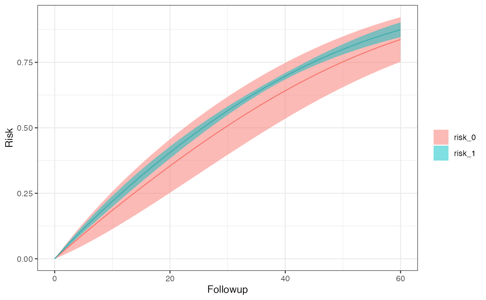
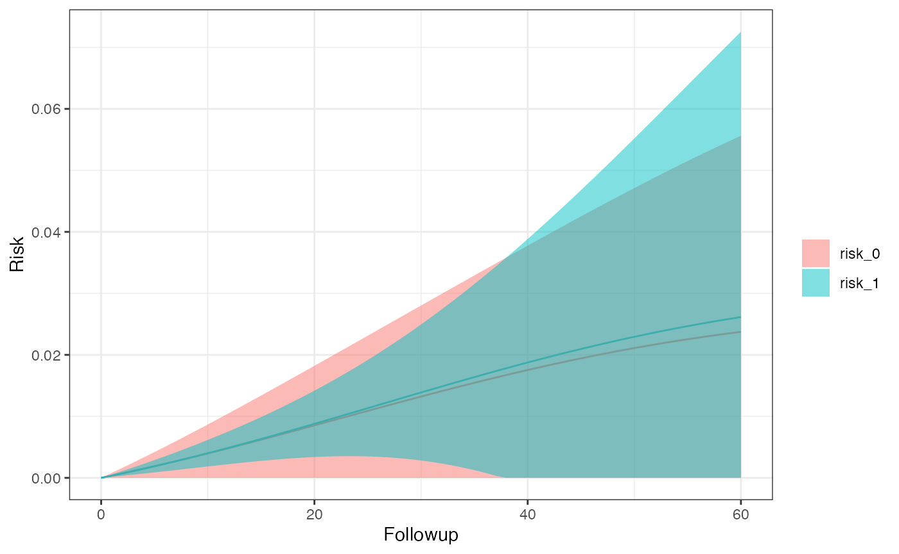
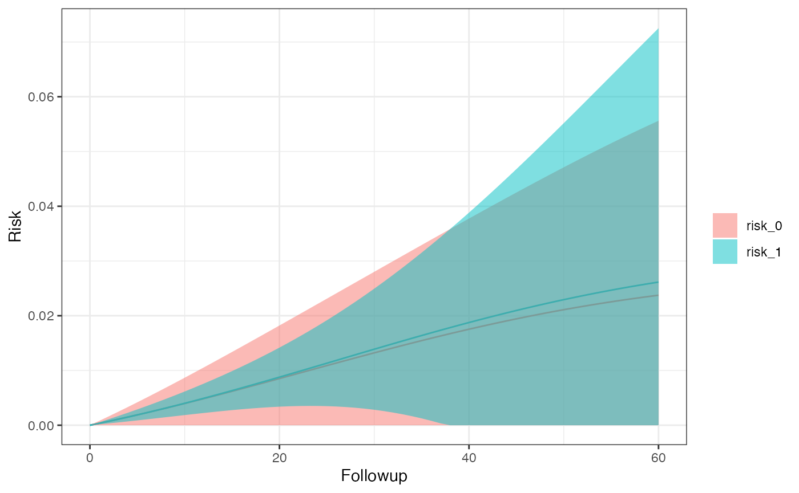
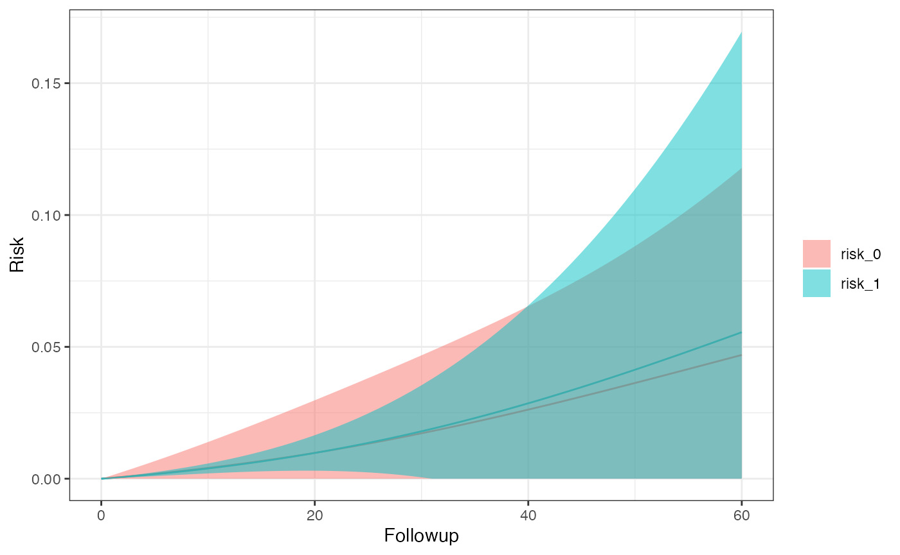
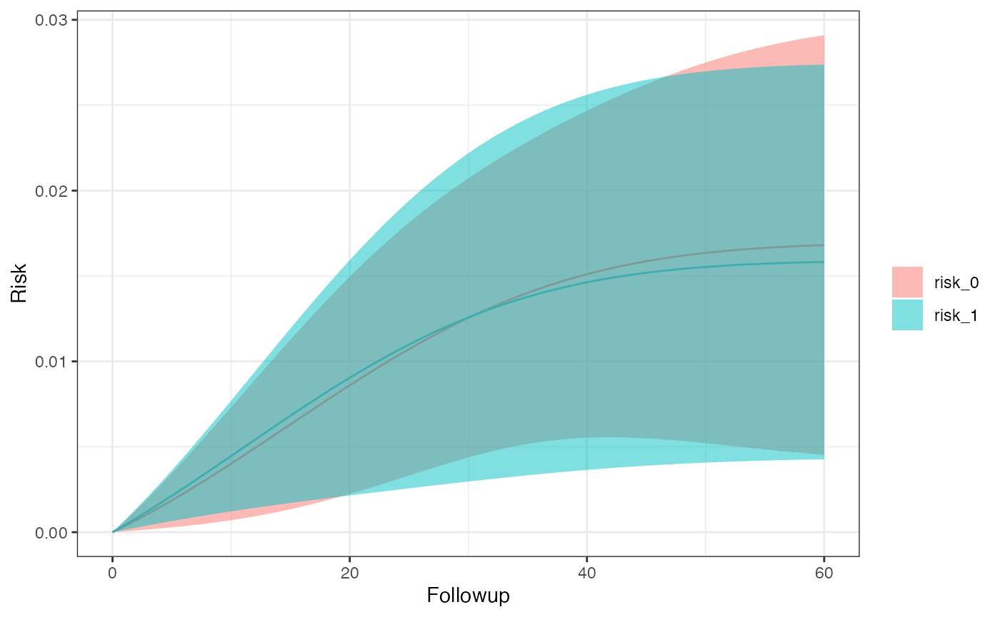

# Intention-To-Treat Analysis

Here, we’ll go over some examples of using ITT. First we need to load
the library before getting in to some sample use cases.

``` r

library(SEQTaRget)
```

## ITT With 5 bootstrap samples

``` r

options <- SEQopts(# tells SEQuential to create Kaplan-Meier curves
                   km.curves = TRUE,
                   # tells SEQuential to bootstrap
                   bootstrap = TRUE,
                   seed = 1636,
                   # tells SEQuential to run bootstraps 5 times
                   bootstrap.nboot = 5)

# use example data
data <- SEQdata                             
model <- SEQuential(data, id.col = "ID", 
                          time.col = "time", 
                          eligible.col = "eligible", 
                          treatment.col = "tx_init", 
                          outcome.col = "outcome", 
                          time_varying.cols = c("N", "L", "P"), 
                          fixed.cols = "sex",
                          method = "ITT", 
                          options = options)
#> 
#> Full dataset: 12,180 observations, 11 variables
#> 
#> Non-required columns provided, pruning for efficiency
#> 
#> Pruned
#> 
#> Original dataset (eligible subjects): 9,203 observations, 9 variables
#> 
#> Expanding Data...
#> 
#> Pre-filter expansion: 310,080 observations
#> 
#> Expanded dataset: 248,485 observations, 13 variables
#> 
#> Expansion Successful
#> 
#> Final analysis dataset: 248,485 observations, 13 variables
#> 
#> Moving forward with ITT analysis
#> 
#> Bootstrapping with 80% of 300 subjects (240 subjects, ~198,788 observations per resample) 5 times
#> 
#> ITT model created successfully
#> 
#> Creating Survival curves
#> 
#> Completed

km_curve(model, plot.type = "risk")        # retrieve risk plot
```



``` r

risk_data(model)
#> Index: <Followup>
#>    Method Followup      A      Risk   95% LCI  95% UCI         SE
#>    <char>    <num> <char>     <num>     <num>    <num>      <num>
#> 1:    ITT       60      0 0.8372582 0.7519414 0.922575 0.04352979
#> 2:    ITT       60      1 0.8744359 0.8461448 0.902727 0.01443450
risk_comparison(model)
#>    Followup    A_x    A_y Risk Ratio RR 95% LCI RR 95% UCI log(RR) SE
#>       <num> <fctr> <fctr>      <num>      <num>      <num>      <num>
#> 1:       60 risk_0 risk_1  1.0444041  0.9648478   1.130520 0.04042492
#> 2:       60 risk_1 risk_0  0.9574838  0.8845486   1.036433 0.04042492
#>    Risk Difference RD 95% LCI RD 95% UCI      RD SE
#>              <num>      <num>      <num>      <num>
#> 1:      0.03717768 -0.0278918  0.1022472 0.03319932
#> 2:     -0.03717768 -0.1022472  0.0278918 0.03319932
```

## ITT with 5 bootstrap samples and losses-to-followup

``` r

options <- SEQopts(km.curves = TRUE,               
                   bootstrap = TRUE,                
                   seed = 1636,
                   bootstrap.nboot = 5,
                   # tells SEQuential to expect LTFU as the censoring column
                   cense = "LTFU",
                   # tells SEQuential to treat this column as the 
                   # censoring eligibility column
                   cense.eligible = "eligible_cense")

# use example data for LTFU
data <- SEQdata.LTFU
model <- SEQuential(data, id.col = "ID", 
                          time.col = "time", 
                          eligible.col = "eligible", 
                          treatment.col = "tx_init", 
                          outcome.col = "outcome", 
                          time_varying.cols = c("N", "L", "P"), 
                          fixed.cols = "sex",
                          method = "ITT", 
                          options = options)
#> 
#> Full dataset: 54,687 observations, 13 variables
#> 
#> Non-required columns provided, pruning for efficiency
#> 
#> Pruned
#> 
#> Original dataset (eligible subjects): 29,624 observations, 11 variables
#> 
#> Expanding Data...
#> 
#> Pre-filter expansion: 1,609,859 observations
#> 
#> Expanded dataset: 1,119,229 observations, 18 variables
#> 
#> Expansion Successful
#> 
#> Final analysis dataset: 1,119,229 observations, 18 variables
#> 
#> Moving forward with ITT analysis
#> 
#> Bootstrapping with 80% of 1,000 subjects (800 subjects, ~895,383 observations per resample) 5 times
#> 
#> ITT model created successfully
#> 
#> Creating Survival curves
#> 
#> Completed

km_curve(model, plot.type = "risk")
```



``` r

risk_data(model)
#> Index: <Followup>
#>    Method Followup      A       Risk 95% LCI    95% UCI         SE
#>    <char>    <num> <char>      <num>   <num>      <num>      <num>
#> 1:    ITT       60      0 0.02374360       0 0.05562653 0.01626710
#> 2:    ITT       60      1 0.02614576       0 0.07255455 0.02367839
risk_comparison(model)
#>    Followup    A_x    A_y Risk Ratio RR 95% LCI RR 95% UCI log(RR) SE
#>       <num> <fctr> <fctr>      <num>      <num>      <num>      <num>
#> 1:       60 risk_0 risk_1  1.1011710  0.8154451   1.487013  0.1532658
#> 2:       60 risk_1 risk_0  0.9081242  0.6724890   1.226324  0.1532658
#>    Risk Difference  RD 95% LCI RD 95% UCI       RD SE
#>              <num>       <num>      <num>       <num>
#> 1:     0.002402164 -0.01469810 0.01950243 0.008724784
#> 2:    -0.002402164 -0.01950243 0.01469810 0.008724784
```

## ITT with 5 bootstrap samples and competing events

``` r

options <- SEQopts(km.curves = TRUE,               
                   bootstrap = TRUE,                
                   seed = 1636,
                   bootstrap.nboot = 5,
                   # Using LTFU as our competing event
                   compevent = "LTFU")

data <- SEQdata.LTFU
model <- SEQuential(data, id.col = "ID", 
                          time.col = "time", 
                          eligible.col = "eligible", 
                          treatment.col = "tx_init", 
                          outcome.col = "outcome", 
                          time_varying.cols = c("N", "L", "P"), 
                          fixed.cols = "sex",
                          method = "ITT", 
                          options = options)
#> 
#> Full dataset: 54,687 observations, 13 variables
#> 
#> Non-required columns provided, pruning for efficiency
#> 
#> Pruned
#> 
#> Original dataset (eligible subjects): 29,624 observations, 10 variables
#> 
#> Expanding Data...
#> 
#> Pre-filter expansion: 1,609,859 observations
#> 
#> Expanded dataset: 1,119,229 observations, 14 variables
#> 
#> Expansion Successful
#> 
#> Final analysis dataset: 1,119,229 observations, 14 variables
#> 
#> Moving forward with ITT analysis
#> 
#> Bootstrapping with 80% of 1,000 subjects (800 subjects, ~895,383 observations per resample) 5 times
#> 
#> ITT model created successfully
#> 
#> Creating Survival curves
#> 
#> Completed

km_curve(model, plot.type = "risk")
```



``` r

risk_data(model)
#> Index: <Followup>
#>    Method Followup      A       Risk 95% LCI    95% UCI         SE
#>    <char>    <num> <char>      <num>   <num>      <num>      <num>
#> 1:    ITT       60      0 0.02185652       0 0.05072346 0.01472830
#> 2:    ITT       60      1 0.02381601       0 0.06530060 0.02116599
risk_comparison(model)
#>    Followup    A_x    A_y Risk Ratio RR 95% LCI RR 95% UCI log(RR) SE
#>       <num> <fctr> <fctr>      <num>      <num>      <num>      <num>
#> 1:       60  inc_0  inc_1  1.0896524  0.8076389   1.470140  0.1528084
#> 2:       60  inc_1  inc_0  0.9177239  0.6802073   1.238177  0.1528084
#>    Risk Difference  RD 95% LCI RD 95% UCI       RD SE
#>              <num>       <num>      <num>       <num>
#> 1:     0.001959489 -0.01330796 0.01722693 0.007789656
#> 2:    -0.001959489 -0.01722693 0.01330796 0.007789656
```

## ITT hazard ratio with 5 bootstrap samples and competing events

``` r

options <- SEQopts(# km.curves must be set to FALSE to turn on hazard 
                   # ratio creation
                   km.curves = FALSE,
                   # set hazard to TRUE for hazard ratio creation
                   hazard = TRUE,
                   bootstrap = TRUE,                
                   seed = 1636,
                   bootstrap.nboot = 5,     
                   compevent = "LTFU")

data <- SEQdata.LTFU                          
model <- SEQuential(data, id.col = "ID", 
                          time.col = "time", 
                          eligible.col = "eligible", 
                          treatment.col = "tx_init", 
                          outcome.col = "outcome", 
                          time_varying.cols = c("N", "L", "P"), 
                          fixed.cols = "sex",
                          method = "ITT", 
                          options = options)
#> 
#> Full dataset: 54,687 observations, 13 variables
#> 
#> Non-required columns provided, pruning for efficiency
#> 
#> Pruned
#> 
#> Original dataset (eligible subjects): 29,624 observations, 10 variables
#> 
#> Expanding Data...
#> 
#> Pre-filter expansion: 1,609,859 observations
#> 
#> Expanded dataset: 1,119,229 observations, 14 variables
#> 
#> Expansion Successful
#> 
#> Final analysis dataset: 1,119,229 observations, 14 variables
#> 
#> Moving forward with ITT analysis
#> 
#> Bootstrapping with 80% of 1,000 subjects (800 subjects, ~895,383 observations per resample) 5 times
#> 
#> Completed

# retrieve hazard ratios
hazard_ratio(model)
#> Hazard ratio          LCI          UCI 
#>    1.1241440    0.8026793    1.5743518
```

## ITT with 5 bootstrap samples and competing events in subgroups defined by sex

``` r

options <- SEQopts(km.curves = TRUE,               
                   bootstrap = TRUE,                
                   seed = 1636,
                   bootstrap.nboot = 5,     
                   compevent = "LTFU",
                   # define the subgroup
                   subgroup = "sex")

data <- SEQdata.LTFU
model <- SEQuential(data, id.col = "ID", 
                          time.col = "time", 
                          eligible.col = "eligible", 
                          treatment.col = "tx_init", 
                          outcome.col = "outcome", 
                          time_varying.cols = c("N", "L", "P"), 
                          fixed.cols = "sex",
                          method = "ITT", 
                          options = options)
#> 
#> Full dataset: 54,687 observations, 13 variables
#> 
#> Non-required columns provided, pruning for efficiency
#> 
#> Pruned
#> 
#> Original dataset (eligible subjects): 29,624 observations, 10 variables
#> 
#> Expanding Data...
#> 
#> Pre-filter expansion: 1,609,859 observations
#> 
#> Expanded dataset: 1,119,229 observations, 14 variables
#> 
#> Expansion Successful
#> 
#> Final analysis dataset: 1,119,229 observations, 14 variables
#> 
#> Moving forward with ITT analysis
#> 
#> Bootstrapping with 80% of 1,000 subjects (800 subjects, ~895,383 observations per resample) 5 times
#> 
#> ITT model created successfully
#> 
#> Creating Survival Curves for sex_0 
#> 
#> Creating Survival Curves for sex_1 
#> 
#> Completed

km_curve(model, plot.type = "risk")
#> $sex_0
```



    #> 
    #> $sex_1



``` r

risk_data(model)
#> $sex_0
#> Index: <Followup>
#>    Method Followup      A       Risk 95% LCI   95% UCI         SE
#>    <char>    <num> <char>      <num>   <num>     <num>      <num>
#> 1:    ITT       60      0 0.04213833       0 0.1040693 0.03159803
#> 2:    ITT       60      1 0.04911213       0 0.1479362 0.05042138
#> 
#> $sex_1
#> Index: <Followup>
#>    Method Followup      A       Risk     95% LCI    95% UCI          SE
#>    <char>    <num> <char>      <num>       <num>      <num>       <num>
#> 1:    ITT       60      0 0.01577026 0.004561386 0.02697913 0.005718917
#> 2:    ITT       60      1 0.01484521 0.003821687 0.02586873 0.005624349
risk_comparison(model)
#> $sex_0
#>    Followup    A_x    A_y Risk Ratio RR 95% LCI RR 95% UCI log(RR) SE
#>       <num> <fctr> <fctr>      <num>      <num>      <num>      <num>
#> 1:       60  inc_0  inc_1  1.1654977  0.4953457   2.742297   0.436563
#> 2:       60  inc_1  inc_0  0.8580026  0.3646578   2.018792   0.436563
#>    Risk Difference  RD 95% LCI RD 95% UCI      RD SE
#>              <num>       <num>      <num>      <num>
#> 1:     0.006973797 -0.06046781 0.07441540 0.03440961
#> 2:    -0.006973797 -0.07441540 0.06046781 0.03440961
#> 
#> $sex_1
#>    Followup    A_x    A_y Risk Ratio RR 95% LCI RR 95% UCI log(RR) SE
#>       <num> <fctr> <fctr>      <num>      <num>      <num>      <num>
#> 1:       60  inc_0  inc_1  0.9413422  0.6122541   1.447316  0.2194731
#> 2:       60  inc_1  inc_0  1.0623130  0.6909341   1.633309  0.2194731
#>    Risk Difference   RD 95% LCI  RD 95% UCI       RD SE
#>              <num>        <num>       <num>       <num>
#> 1:   -0.0009250492 -0.008838726 0.006988628 0.004037664
#> 2:    0.0009250492 -0.006988628 0.008838726 0.004037664
```
