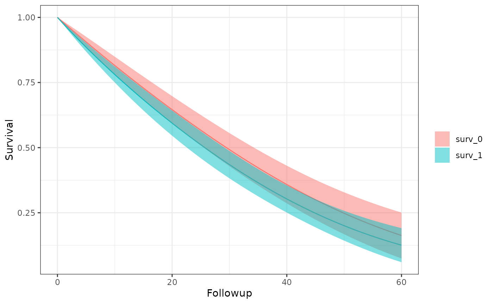

# Introduction to SEQuential

## Setting up your Analysis

There are some assumptions which must be met to avoid unintended errors
when using SEQuential. These are:

1.  User provided `time.col` begins at 0 per unique `id.col` entries, we
    also assume that the column contains only integers and continues by
    1 for every time step. e.g. (0, 1, 2, 3, …) is allowed and (0, 1, 2,
    2.5, …) or (0, 1, 2, 4, 5, …) are not.
2.  Provided `time.col` entries may be out of order as a sort is
    enforced at the beginning of the function, e.g. (0, 2, 1, 4, 3, …)
    is valid because it begins at 0 and is continuously increasing by
    increments of 1, even though it is not ordered.
3.  `eligible` and column names provided to and `excused.cols` are once
    one only one (with respect to `time.col`) flag variables

### Step 1 - Defining your options

In your R script, you will always start by defining your options object,
through the `SEQopts` helper. There are many defaults which allow you to
target exactly how you would like to change your analysis. Through this
wiki there are specific pages dedicated to each causal contrast and the
parameters which affect them, but for simplicity let’s start with an
intention-to-treat analysis with 20 bootstrap samples.

``` r
library(SEQTaRget)

options <- SEQopts(km.curves = TRUE, #asks the function to return survival and risk estimates
                   bootstrap = TRUE, #asks the model to preform bootstrapping
                   bootstrap.nboot = 10) #asks the model for 10 bootstrap samples
```

In general, options will be in the form `{option}.{parameter}` - here
you may notice that we use `bootstrap.nboot` indicating that this
parameter affects the `bootstrap`

### Step 2 - Running the Primary Function

The next step is running the primary R function, `SEQuential`. Here you
will give your options, data, and data-level information. We provide
some small simulated datasets to test on.

``` r
data <- SEQdata
model <- SEQuential(data, id.col = "ID", 
                          time.col = "time", 
                          eligible.col = "eligible",
                          treatment.col = "tx_init",
                          outcome.col = "outcome",
                          time_varying.cols = c("N", "L", "P"),
                          fixed.cols = "sex",
                          method = "ITT", options = options)
#> Non-required columns provided, pruning for efficiency
#> Pruned
#> Expanding Data...
#> Expansion Successful
#> Moving forward with ITT analysis
#> Bootstrapping with 80 % of data 10 times
#> ITT model created successfully
#> Creating Survival curves
#> Scale for colour is already present.
#> Adding another scale for colour, which will replace the existing scale.
#> Completed
```

`SEQuential` is a rather chunky algorithm and will take some time to
run, especially when bootstrapping. We provide some print statements to
help track where the function is processing at any given point in time.

### Step 3 - Recovering your results

`SEQuential` produces a lot of internal diagnostics, models, and
dataframes out of its main function in an S4 class. We provide a few
different methods to handle obtaining your results.

``` r
outcome(model)     # Returns a list of only the outcome models 
#> [[1]]
#> [[1]][[1]]
#> 
#> Call:
#> fastglm.default(x = X, y = y, family = quasibinomial(), method = params@fastglm.method)
#> 
#> Coefficients:
#>           (Intercept)          tx_init_bas1              followup 
#>           -6.85931555            0.22530938            0.03538172 
#>           followup_sq                 trial              trial_sq 
#>           -0.00015987            0.04471790            0.00057617 
#>                  sex1                 N_bas                 L_bas 
#>            0.12704583            0.00328671           -0.01385088 
#>                 P_bas tx_init_bas1:followup 
#>            0.20092890           -0.00170402 
#> 
#> [[1]][[2]]
#> 
#> Call:
#> fastglm.default(x = X, y = y, family = quasibinomial(), method = params@fastglm.method)
#> 
#> Coefficients:
#>           (Intercept)          tx_init_bas1              followup 
#>           -7.46906316            0.16075823            0.03968600 
#>           followup_sq                 trial              trial_sq 
#>           -0.00016337            0.06317372            0.00051575 
#>                  sex1                 N_bas                 L_bas 
#>            0.00464424            0.00241233           -0.06868235 
#>                 P_bas tx_init_bas1:followup 
#>            0.27365946           -0.00077319 
#> 
#> [[1]][[3]]
#> 
#> Call:
#> fastglm.default(x = X, y = y, family = quasibinomial(), method = params@fastglm.method)
#> 
#> Coefficients:
#>           (Intercept)          tx_init_bas1              followup 
#>           -9.87523938            0.26235241            0.02797899 
#>           followup_sq                 trial              trial_sq 
#>           -0.00021462            0.10306998            0.00018159 
#>                  sex1                 N_bas                 L_bas 
#>            0.00388615            0.00070528           -0.09600071 
#>                 P_bas tx_init_bas1:followup 
#>            0.55374949            0.00050784 
#> 
#> [[1]][[4]]
#> 
#> Call:
#> fastglm.default(x = X, y = y, family = quasibinomial(), method = params@fastglm.method)
#> 
#> Coefficients:
#>           (Intercept)          tx_init_bas1              followup 
#>           -1.5069e+01            4.1291e-02            4.0264e-02 
#>           followup_sq                 trial              trial_sq 
#>           -8.4252e-05            2.0695e-01           -3.7735e-04 
#>                  sex1                 N_bas                 L_bas 
#>           -8.5190e-02            2.0471e-04           -7.3809e-02 
#>                 P_bas tx_init_bas1:followup 
#>            1.0587e+00            5.3275e-03 
#> 
#> [[1]][[5]]
#> 
#> Call:
#> fastglm.default(x = X, y = y, family = quasibinomial(), method = params@fastglm.method)
#> 
#> Coefficients:
#>           (Intercept)          tx_init_bas1              followup 
#>           -8.3657e+00            3.1649e-02            2.9451e-02 
#>           followup_sq                 trial              trial_sq 
#>           -2.4690e-04            8.6897e-02           -8.0278e-05 
#>                  sex1                 N_bas                 L_bas 
#>            1.0237e-01            1.8780e-03            1.6773e-02 
#>                 P_bas tx_init_bas1:followup 
#>            3.8673e-01           -1.7781e-03 
#> 
#> [[1]][[6]]
#> 
#> Call:
#> fastglm.default(x = X, y = y, family = quasibinomial(), method = params@fastglm.method)
#> 
#> Coefficients:
#>           (Intercept)          tx_init_bas1              followup 
#>           -3.57307036            0.30009685            0.03605381 
#>           followup_sq                 trial              trial_sq 
#>           -0.00032383           -0.01642147            0.00095613 
#>                  sex1                 N_bas                 L_bas 
#>            0.12126892            0.00336200           -0.10718593 
#>                 P_bas tx_init_bas1:followup 
#>           -0.13662391           -0.00433469 
#> 
#> [[1]][[7]]
#> 
#> Call:
#> fastglm.default(x = X, y = y, family = quasibinomial(), method = params@fastglm.method)
#> 
#> Coefficients:
#>           (Intercept)          tx_init_bas1              followup 
#>           -9.41138584            0.10204396            0.01855281 
#>           followup_sq                 trial              trial_sq 
#>           -0.00021491            0.08791803            0.00019225 
#>                  sex1                 N_bas                 L_bas 
#>            0.23804524            0.00625242            0.03942423 
#>                 P_bas tx_init_bas1:followup 
#>            0.50596492            0.00706765 
#> 
#> [[1]][[8]]
#> 
#> Call:
#> fastglm.default(x = X, y = y, family = quasibinomial(), method = params@fastglm.method)
#> 
#> Coefficients:
#>           (Intercept)          tx_init_bas1              followup 
#>           -8.29000818            0.46723157            0.04876310 
#>           followup_sq                 trial              trial_sq 
#>           -0.00031351            0.06089517            0.00053714 
#>                  sex1                 N_bas                 L_bas 
#>            0.15402934            0.00597165            0.00971093 
#>                 P_bas tx_init_bas1:followup 
#>            0.30350362           -0.00754251 
#> 
#> [[1]][[9]]
#> 
#> Call:
#> fastglm.default(x = X, y = y, family = quasibinomial(), method = params@fastglm.method)
#> 
#> Coefficients:
#>           (Intercept)          tx_init_bas1              followup 
#>           -5.22996278            0.39963780            0.03466171 
#>           followup_sq                 trial              trial_sq 
#>           -0.00034686            0.00275831            0.00077561 
#>                  sex1                 N_bas                 L_bas 
#>            0.02237348            0.00637046            0.05135397 
#>                 P_bas tx_init_bas1:followup 
#>            0.05294198           -0.00600593 
#> 
#> [[1]][[10]]
#> 
#> Call:
#> fastglm.default(x = X, y = y, family = quasibinomial(), method = params@fastglm.method)
#> 
#> Coefficients:
#>           (Intercept)          tx_init_bas1              followup 
#>            1.7772e+00            1.0381e-01            1.9651e-02 
#>           followup_sq                 trial              trial_sq 
#>            4.1896e-05           -1.1177e-01            1.6744e-03 
#>                  sex1                 N_bas                 L_bas 
#>           -9.6427e-02            1.8383e-03           -1.7448e-01 
#>                 P_bas tx_init_bas1:followup 
#>           -6.7275e-01            2.7958e-03 
#> 
#> [[1]][[11]]
#> 
#> Call:
#> fastglm.default(x = X, y = y, family = quasibinomial(), method = params@fastglm.method)
#> 
#> Coefficients:
#>           (Intercept)          tx_init_bas1              followup 
#>           -1.3002e+01            3.4162e-01            3.9734e-02 
#>           followup_sq                 trial              trial_sq 
#>           -2.9124e-04            1.6760e-01           -4.7647e-04 
#>                  sex1                 N_bas                 L_bas 
#>           -1.9991e-02           -3.3938e-03            1.8713e-02 
#>                 P_bas tx_init_bas1:followup 
#>            8.8180e-01           -7.5343e-03
km_curve(model)    # Prints the survival curve
#> Scale for colour is already present.
#> Adding another scale for colour, which will replace the existing scale.
#> [[1]]
```



``` r
risk_data(model)
#> [[1]]
#>    Method      A      Risk   95% LCI   95% UCI         SE
#>    <char> <char>     <num>     <num>     <num>      <num>
#> 1:    ITT      0 0.8372582 0.7492100 0.9253064 0.04492340
#> 2:    ITT      1 0.8744359 0.8090922 0.9397796 0.03333925
risk_comparison(model)
#> [[1]]
#>       A_x    A_y Risk Ratio RR 95% LCI RR 95% UCI Risk Differerence  RD 95% LCI
#>    <fctr> <fctr>      <num>      <num>      <num>             <num>       <num>
#> 1: risk_0 risk_1  1.0444041   0.917996   1.188219        0.03717768 -0.07246854
#> 2: risk_1 risk_0  0.9574838   0.841596   1.089329       -0.03717768 -0.14682390
#>    RD 95% UCI
#>         <num>
#> 1: 0.14682390
#> 2: 0.07246854
```
