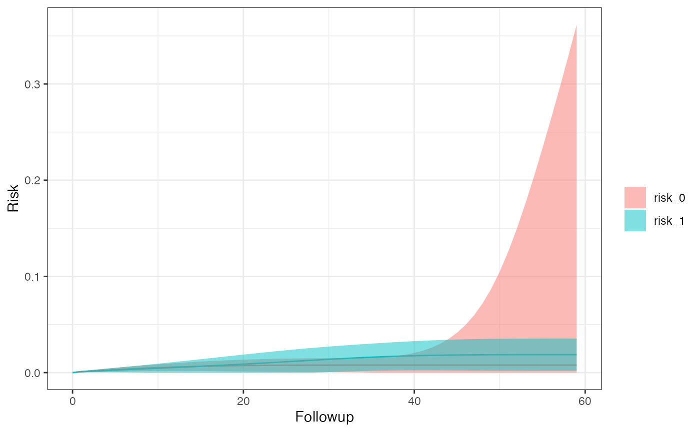
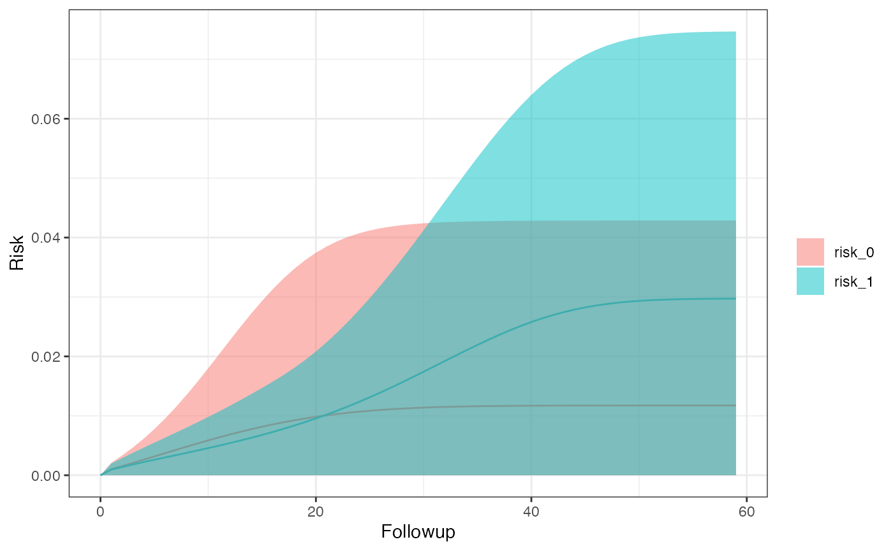
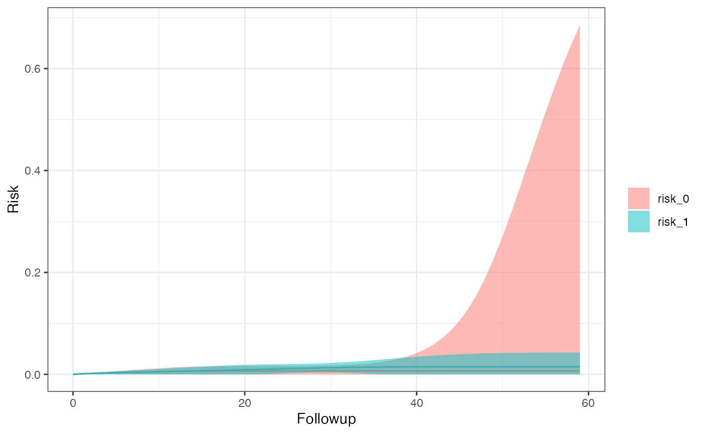

# Per-Protocol: Dose-Response Analysis

Here, we’ll go over some examples of using dose-response. First we need
to load the library before getting in to some sample use cases.

``` r
library(SEQTaRget)
```

Currently, dose-response analysis through SEQuential only supports
binary treatment values. Therefore; running multinomial models will lead
to errors.

## Dose-response With 5 bootstrap samples

``` r
options <- SEQopts(# tells SEQuential to create Kaplan-Meier curves
                   km.curves = TRUE,
                   # tells SEQuential to bootstrap
                   bootstrap = TRUE,
                   # tells SEQuential to run bootstraps 5 times
                   bootstrap.nboot = 5)

# use example data
data <- SEQdata                             
model <- SEQuential(data, id.col = "ID", 
                          time.col = "time", 
                          eligible.col = "eligible", 
                          treatment.col = "tx_init", 
                          outcome.col = "outcome", 
                          time_varying.cols = c("N", "L", "P"), 
                          fixed.cols = "sex",
                          method = "dose-response", 
                          options = options)
#> Non-required columns provided, pruning for efficiency
#> Pruned
#> Expanding Data...
#> Expansion Successful
#> Moving forward with dose-response analysis
#> Bootstrapping with 80 % of data 5 times
#> dose-response model created successfully
#> Creating Survival curves
#> Completed

km_curve(model, plot.type = "risk")        # retrieve risk plot
```


``` r
risk_data(model)
#>           Method      A      Risk   95% LCI   95% UCI         SE
#>           <char> <char>     <num>     <num>     <num>      <num>
#> 1: dose-response      0 0.5282782 0.1234894 0.9330671 0.20652872
#> 2: dose-response      1 0.8949096 0.8385037 0.9513155 0.02877903
risk_comparison(model)
#>       A_x    A_y Risk Ratio RR 95% LCI RR 95% UCI Risk Differerence  RD 95% LCI
#>    <fctr> <fctr>      <num>      <num>      <num>             <num>       <num>
#> 1: risk_0 risk_1  1.6940120  0.7764767   3.695766         0.3666314 -0.07309331
#> 2: risk_1 risk_0  0.5903146  0.2705799   1.287869        -0.3666314 -0.80635612
#>    RD 95% UCI
#>         <num>
#> 1: 0.80635612
#> 2: 0.07309331
```

## Dose-response with 5 bootstrap samples and losses-to-followup

``` r
options <- SEQopts(km.curves = TRUE,               
                   bootstrap = TRUE,                
                   bootstrap.nboot = 5,
                   # tells SEQuential to expect LTFU as the censoring column
                   cense = "LTFU",
                   # tells SEQuential to treat this column as the 
                   # censoring eligibility column
                   cense.eligible = "eligible_cense")

# use example data for LTFU
data <- SEQdata.LTFU
model <- SEQuential(data, id.col = "ID", 
                          time.col = "time", 
                          eligible.col = "eligible", 
                          treatment.col = "tx_init", 
                          outcome.col = "outcome", 
                          time_varying.cols = c("N", "L", "P"), 
                          fixed.cols = "sex",
                          method = "dose-response", 
                          options = options)
#> Non-required columns provided, pruning for efficiency
#> Pruned
#> Expanding Data...
#> Expansion Successful
#> Moving forward with dose-response analysis
#> Bootstrapping with 80 % of data 5 times
#> dose-response model created successfully
#> Creating Survival curves
#> Completed

km_curve(model, plot.type = "risk")
```


``` r
risk_data(model)
#>           Method      A        Risk     95% LCI    95% UCI          SE
#>           <char> <char>       <num>       <num>      <num>       <num>
#> 1: dose-response      0 0.007847443 0.000000000 0.02684988 0.009695299
#> 2: dose-response      1 0.018827788 0.001997953 0.03565762 0.008586808
risk_comparison(model)
#>       A_x    A_y Risk Ratio RR 95% LCI RR 95% UCI Risk Differerence  RD 95% LCI
#>    <fctr> <fctr>      <num>      <num>      <num>             <num>       <num>
#> 1: risk_0 risk_1  2.3992259 0.44856850  12.832566        0.01098034 -0.01349983
#> 2: risk_1 risk_0  0.4168011 0.07792674   2.229314       -0.01098034 -0.03546052
#>    RD 95% UCI
#>         <num>
#> 1: 0.03546052
#> 2: 0.01349983
```

## Dose-response with 5 bootstrap samples and competing events

``` r
options <- SEQopts(km.curves = TRUE,               
                   bootstrap = TRUE,                
                   bootstrap.nboot = 5,
                   # Using LTFU as our competing event
                   compevent = "LTFU")

data <- SEQdata.LTFU
model <- SEQuential(data, id.col = "ID", 
                          time.col = "time", 
                          eligible.col = "eligible", 
                          treatment.col = "tx_init", 
                          outcome.col = "outcome", 
                          time_varying.cols = c("N", "L", "P"), 
                          fixed.cols = "sex",
                          method = "dose-response", 
                          options = options)
#> Non-required columns provided, pruning for efficiency
#> Pruned
#> Expanding Data...
#> Expansion Successful
#> Moving forward with dose-response analysis
#> Bootstrapping with 80 % of data 5 times
#> dose-response model created successfully
#> Creating Survival curves
#> Completed

km_curve(model, plot.type = "risk")
```



``` r
risk_data(model)
#>           Method      A        Risk 95% LCI    95% UCI         SE
#>           <char> <char>       <num>   <num>      <num>      <num>
#> 1: dose-response      0 0.007586789       0 0.25972299 0.12864328
#> 2: dose-response      1 0.003641046       0 0.02703035 0.01193354
risk_comparison(model)
#>       A_x    A_y Risk Ratio RR 95% LCI RR 95% UCI Risk Differerence RD 95% LCI
#>    <fctr> <fctr>      <num>      <num>      <num>             <num>      <num>
#> 1:  inc_0  inc_1  0.4799192 0.02752717   8.367096      -0.003945743 -0.2462717
#> 2:  inc_1  inc_0  2.0836841 0.11951578  36.327751       0.003945743 -0.2383802
#>    RD 95% UCI
#>         <num>
#> 1:  0.2383802
#> 2:  0.2462717
```

## Dose-response hazard ratio with 5 bootstrap samples and competing events

``` r
options <- SEQopts(# km.curves must be set to FALSE to turn on hazard 
                   # ratio creation
                   km.curves = FALSE,
                   # set hazard to TRUE for hazard ratio creation
                   hazard = TRUE,
                   bootstrap = TRUE,                
                   bootstrap.nboot = 5,     
                   compevent = "LTFU")

data <- SEQdata.LTFU                          
model <- SEQuential(data, id.col = "ID", 
                          time.col = "time", 
                          eligible.col = "eligible", 
                          treatment.col = "tx_init", 
                          outcome.col = "outcome", 
                          time_varying.cols = c("N", "L", "P"), 
                          fixed.cols = "sex",
                          method = "dose-response", 
                          options = options)
#> Non-required columns provided, pruning for efficiency
#> Pruned
#> Expanding Data...
#> Expansion Successful
#> Moving forward with dose-response analysis
#> Bootstrapping with 80 % of data 5 times
#> Completed

# retrieve hazard ratios
hazard_ratio(model)
#> Hazard ratio          LCI          UCI 
#>    0.9582143    0.7107252    1.2918841
```

## Dose-response with 5 bootstrap samples and competing events in subgroups defined by sex

``` r
options <- SEQopts(km.curves = TRUE,               
                   bootstrap = TRUE,                
                   bootstrap.nboot = 5,     
                   compevent = "LTFU",
                   # define the subgroup
                   subgroup = "sex")

data <- SEQdata.LTFU
model <- SEQuential(data, id.col = "ID", 
                          time.col = "time", 
                          eligible.col = "eligible", 
                          treatment.col = "tx_init", 
                          outcome.col = "outcome", 
                          time_varying.cols = c("N", "L", "P"), 
                          fixed.cols = "sex",
                          method = "dose-response", 
                          options = options)
#> Non-required columns provided, pruning for efficiency
#> Pruned
#> Expanding Data...
#> Expansion Successful
#> Moving forward with dose-response analysis
#> Bootstrapping with 80 % of data 5 times
#> dose-response model created successfully
#> Creating Survival Curves for sex_0 
#> Creating Survival Curves for sex_1 
#> Completed

km_curve(model, plot.type = "risk")
#> $sex_0
```



    #> 
    #> $sex_1



``` r
risk_data(model)
#> $sex_0
#>           Method      A        Risk 95% LCI    95% UCI         SE
#>           <char> <char>       <num>   <num>      <num>      <num>
#> 1: dose-response      0 0.011257533       0 0.04037236 0.01485477
#> 2: dose-response      1 0.004588216       0 0.04979271 0.02306394
#> 
#> $sex_1
#>           Method      A        Risk 95% LCI    95% UCI         SE
#>           <char> <char>       <num>   <num>      <num>      <num>
#> 1: dose-response      0 0.006598380       0 0.47302574 0.23797751
#> 2: dose-response      1 0.004921131       0 0.03904126 0.01740855
risk_comparison(model)
#> $sex_0
#>       A_x    A_y Risk Ratio   RR 95% LCI RR 95% UCI Risk Differerence
#>    <fctr> <fctr>      <num>        <num>      <num>             <num>
#> 1:  inc_0  inc_1  0.4075685 8.170464e-06    20330.8      -0.006669317
#> 2:  inc_1  inc_0  2.4535753 4.918645e-05   122392.1       0.006669317
#>     RD 95% LCI RD 95% UCI
#>          <num>      <num>
#> 1: -0.05854881 0.04521017
#> 2: -0.04521017 0.05854881
#> 
#> $sex_1
#>       A_x    A_y Risk Ratio RR 95% LCI RR 95% UCI Risk Differerence RD 95% LCI
#>    <fctr> <fctr>      <num>      <num>      <num>             <num>      <num>
#> 1:  inc_0  inc_1   0.745809 0.02567347   21.66559      -0.001677249 -0.4377930
#> 2:  inc_1  inc_0   1.340826 0.04615613   38.95071       0.001677249 -0.4344385
#>    RD 95% UCI
#>         <num>
#> 1:  0.4344385
#> 2:  0.4377930
```
