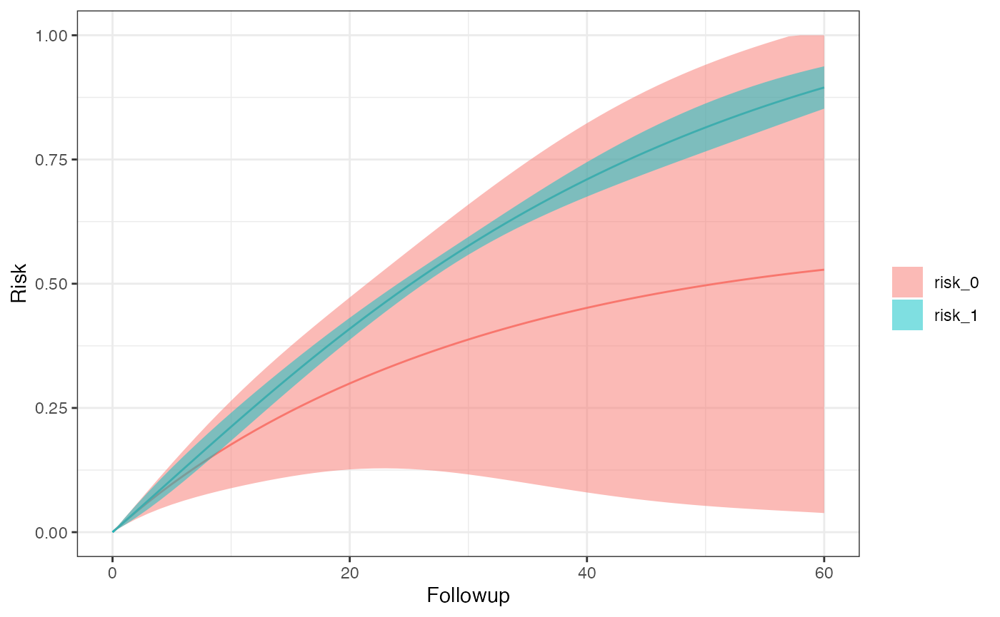
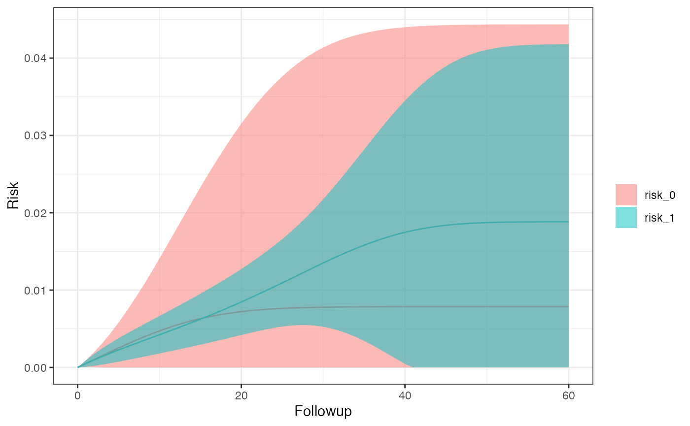
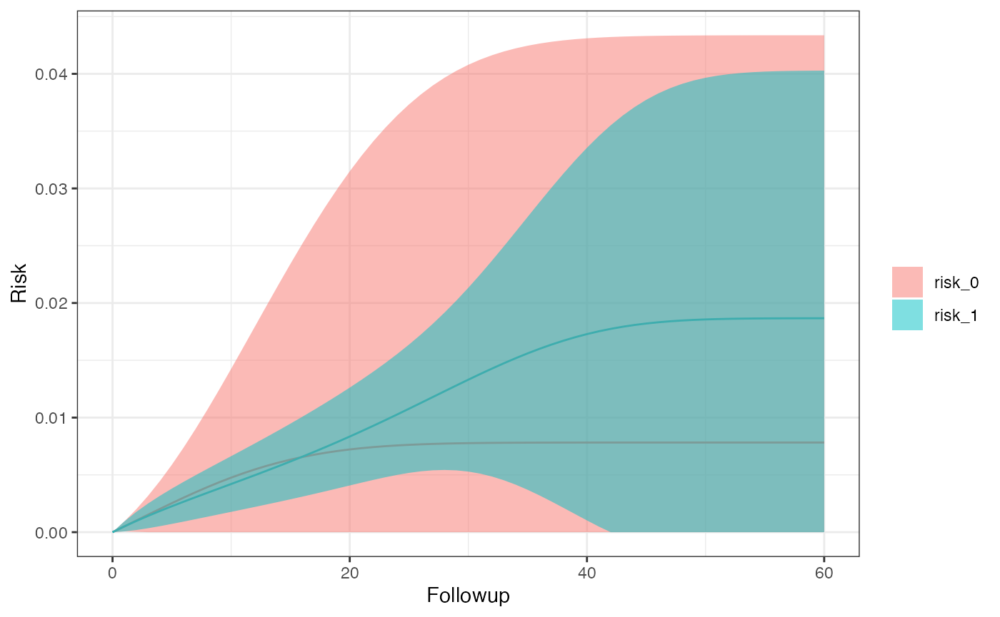
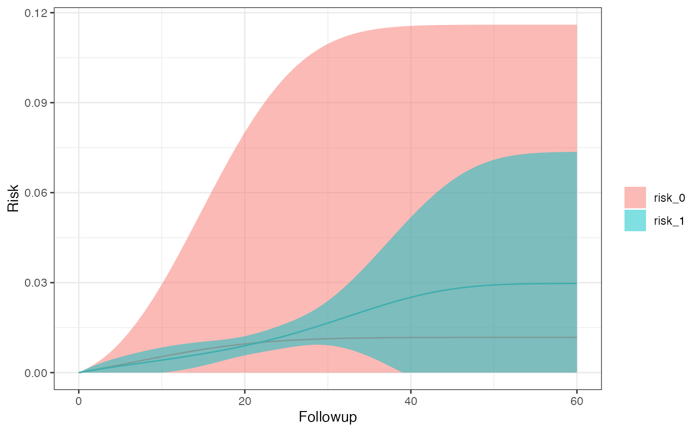
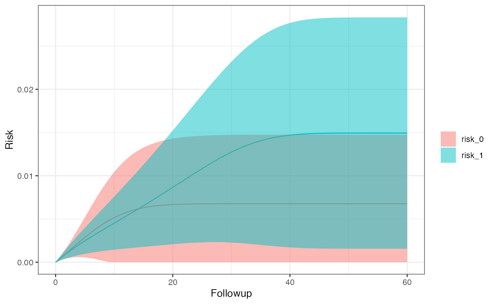

# Per-Protocol: Dose-Response Analysis

Here, we’ll go over some examples of using dose-response. First we need
to load the library before getting in to some sample use cases.

``` r

library(SEQTaRget)
```

Currently, dose-response analysis through SEQuential only supports
binary treatment values. Therefore; running multinomial models will lead
to errors.

## Dose-response With 5 bootstrap samples

``` r

options <- SEQopts(# tells SEQuential to create Kaplan-Meier curves
                   km.curves = TRUE,
                   # tells SEQuential to bootstrap
                   bootstrap = TRUE,
                   seed = 1636,
                   # tells SEQuential to run bootstraps 5 times
                   bootstrap.nboot = 5)

# use example data
data <- SEQdata                             
model <- SEQuential(data, id.col = "ID", 
                          time.col = "time", 
                          eligible.col = "eligible", 
                          treatment.col = "tx_init", 
                          outcome.col = "outcome", 
                          time_varying.cols = c("N", "L", "P"), 
                          fixed.cols = "sex",
                          method = "dose-response", 
                          options = options)
#> 
#> Full dataset: 12,180 observations, 11 variables
#> 
#> Non-required columns provided, pruning for efficiency
#> 
#> Pruned
#> 
#> Original dataset (eligible subjects): 9,203 observations, 9 variables
#> 
#> Expanding Data...
#> 
#> Pre-filter expansion: 310,080 observations
#> 
#> Expanded dataset: 248,485 observations, 15 variables
#> 
#> Expansion Successful
#> 
#> Final analysis dataset: 248,485 observations, 15 variables
#> 
#> Moving forward with dose-response analysis
#> 
#> Bootstrapping with 80% of 300 subjects (240 subjects, ~198,788 observations per resample) 5 times
#> 
#> dose-response model created successfully
#> 
#> Creating Survival curves
#> 
#> Completed

km_curve(model, plot.type = "risk")        # retrieve risk plot
```



``` r

risk_data(model)
#> Index: <Followup>
#>           Method Followup      A      Risk    95% LCI   95% UCI         SE
#>           <char>    <num> <char>     <num>      <num>     <num>      <num>
#> 1: dose-response       60      0 0.5282782 0.03851259 1.0000000 0.24988501
#> 2: dose-response       60      1 0.8949096 0.85228977 0.9375295 0.02174522
risk_comparison(model)
#>    Followup    A_x    A_y Risk Ratio RR 95% LCI RR 95% UCI log(RR) SE
#>       <num> <fctr> <fctr>      <num>      <num>      <num>      <num>
#> 1:       60 risk_0 risk_1  1.6940120  0.7612927   3.769479  0.4080876
#> 2:       60 risk_1 risk_0  0.5903146  0.2652887   1.313555  0.4080876
#>    Risk Difference RD 95% LCI RD 95% UCI     RD SE
#>              <num>      <num>      <num>     <num>
#> 1:       0.3666314 -0.1084919  0.8417547 0.2424143
#> 2:      -0.3666314 -0.8417547  0.1084919 0.2424143
```

## Dose-response with 5 bootstrap samples and losses-to-followup

``` r

options <- SEQopts(km.curves = TRUE,               
                   bootstrap = TRUE,                
                   seed = 1636,
                   bootstrap.nboot = 5,
                   # tells SEQuential to expect LTFU as the censoring column
                   cense = "LTFU",
                   # tells SEQuential to treat this column as the 
                   # censoring eligibility column
                   cense.eligible = "eligible_cense")

# use example data for LTFU
data <- SEQdata.LTFU
model <- SEQuential(data, id.col = "ID", 
                          time.col = "time", 
                          eligible.col = "eligible", 
                          treatment.col = "tx_init", 
                          outcome.col = "outcome", 
                          time_varying.cols = c("N", "L", "P"), 
                          fixed.cols = "sex",
                          method = "dose-response", 
                          options = options)
#> 
#> Full dataset: 54,687 observations, 13 variables
#> 
#> Non-required columns provided, pruning for efficiency
#> 
#> Pruned
#> 
#> Original dataset (eligible subjects): 29,624 observations, 11 variables
#> 
#> Expanding Data...
#> 
#> Pre-filter expansion: 1,609,859 observations
#> 
#> Expanded dataset: 1,119,229 observations, 17 variables
#> 
#> Expansion Successful
#> 
#> Final analysis dataset: 1,119,229 observations, 17 variables
#> 
#> Moving forward with dose-response analysis
#> 
#> Bootstrapping with 80% of 1,000 subjects (800 subjects, ~895,383 observations per resample) 5 times
#> 
#> dose-response model created successfully
#> 
#> Creating Survival curves
#> 
#> Completed

km_curve(model, plot.type = "risk")
```



``` r

risk_data(model)
#> Index: <Followup>
#>           Method Followup      A        Risk 95% LCI    95% UCI         SE
#>           <char>    <num> <char>       <num>   <num>      <num>      <num>
#> 1: dose-response       60      0 0.007847443       0 0.04436325 0.01863086
#> 2: dose-response       60      1 0.018827788       0 0.04180403 0.01172279
risk_comparison(model)
#>    Followup    A_x    A_y Risk Ratio RR 95% LCI RR 95% UCI log(RR) SE
#>       <num> <fctr> <fctr>      <num>      <num>      <num>      <num>
#> 1:       60 risk_0 risk_1  2.3992259 0.21645193  26.593825   1.227335
#> 2:       60 risk_1 risk_0  0.4168011 0.03760271   4.619963   1.227335
#>    Risk Difference  RD 95% LCI RD 95% UCI      RD SE
#>              <num>       <num>      <num>      <num>
#> 1:      0.01098034 -0.01762636 0.03958705 0.01459553
#> 2:     -0.01098034 -0.03958705 0.01762636 0.01459553
```

## Dose-response with 5 bootstrap samples and competing events

``` r

options <- SEQopts(km.curves = TRUE,               
                   bootstrap = TRUE,                
                   seed = 1636,
                   bootstrap.nboot = 5,
                   # Using LTFU as our competing event
                   compevent = "LTFU")

data <- SEQdata.LTFU
model <- SEQuential(data, id.col = "ID", 
                          time.col = "time", 
                          eligible.col = "eligible", 
                          treatment.col = "tx_init", 
                          outcome.col = "outcome", 
                          time_varying.cols = c("N", "L", "P"), 
                          fixed.cols = "sex",
                          method = "dose-response", 
                          options = options)
#> 
#> Full dataset: 54,687 observations, 13 variables
#> 
#> Non-required columns provided, pruning for efficiency
#> 
#> Pruned
#> 
#> Original dataset (eligible subjects): 29,624 observations, 10 variables
#> 
#> Expanding Data...
#> 
#> Pre-filter expansion: 1,609,859 observations
#> 
#> Expanded dataset: 1,119,229 observations, 16 variables
#> 
#> Expansion Successful
#> 
#> Final analysis dataset: 1,119,229 observations, 16 variables
#> 
#> Moving forward with dose-response analysis
#> 
#> Bootstrapping with 80% of 1,000 subjects (800 subjects, ~895,383 observations per resample) 5 times
#> 
#> dose-response model created successfully
#> 
#> Creating Survival curves
#> 
#> Completed

km_curve(model, plot.type = "risk")
```



``` r

risk_data(model)
#> Index: <Followup>
#>           Method Followup      A        Risk 95% LCI    95% UCI         SE
#>           <char>    <num> <char>       <num>   <num>      <num>      <num>
#> 1: dose-response       60      0 0.007586789       0 0.04126782 0.01718451
#> 2: dose-response       60      1 0.003641046       0 0.03315852 0.01506021
risk_comparison(model)
#>    Followup    A_x    A_y Risk Ratio RR 95% LCI RR 95% UCI log(RR) SE
#>       <num> <fctr> <fctr>      <num>      <num>      <num>      <num>
#> 1:       60  inc_0  inc_1  0.4799192 0.03776639   6.098608   1.297064
#> 2:       60  inc_1  inc_0  2.0836841 0.16397183  26.478569   1.297064
#>    Risk Difference  RD 95% LCI RD 95% UCI      RD SE
#>              <num>       <num>      <num>      <num>
#> 1:    -0.003945743 -0.03928796 0.03139647 0.01803207
#> 2:     0.003945743 -0.03139647 0.03928796 0.01803207
```

## Dose-response hazard ratio with 5 bootstrap samples and competing events

``` r

options <- SEQopts(# km.curves must be set to FALSE to turn on hazard 
                   # ratio creation
                   km.curves = FALSE,
                   # set hazard to TRUE for hazard ratio creation
                   hazard = TRUE,
                   bootstrap = TRUE,                
                   seed = 1636,
                   bootstrap.nboot = 5,     
                   compevent = "LTFU")

data <- SEQdata.LTFU                          
model <- SEQuential(data, id.col = "ID", 
                          time.col = "time", 
                          eligible.col = "eligible", 
                          treatment.col = "tx_init", 
                          outcome.col = "outcome", 
                          time_varying.cols = c("N", "L", "P"), 
                          fixed.cols = "sex",
                          method = "dose-response", 
                          options = options)
#> 
#> Full dataset: 54,687 observations, 13 variables
#> 
#> Non-required columns provided, pruning for efficiency
#> 
#> Pruned
#> 
#> Original dataset (eligible subjects): 29,624 observations, 10 variables
#> 
#> Expanding Data...
#> 
#> Pre-filter expansion: 1,609,859 observations
#> 
#> Expanded dataset: 1,119,229 observations, 16 variables
#> 
#> Expansion Successful
#> 
#> Final analysis dataset: 1,119,229 observations, 16 variables
#> 
#> Moving forward with dose-response analysis
#> 
#> Bootstrapping with 80% of 1,000 subjects (800 subjects, ~895,383 observations per resample) 5 times
#> 
#> Completed

# retrieve hazard ratios
hazard_ratio(model)
#> Hazard ratio          LCI          UCI 
#>    1.0922586    0.9723626    1.2269383
```

## Dose-response with 5 bootstrap samples and competing events in subgroups defined by sex

``` r

options <- SEQopts(km.curves = TRUE,               
                   bootstrap = TRUE,                
                   seed = 1636,
                   bootstrap.nboot = 5,     
                   compevent = "LTFU",
                   # define the subgroup
                   subgroup = "sex")

data <- SEQdata.LTFU
model <- SEQuential(data, id.col = "ID", 
                          time.col = "time", 
                          eligible.col = "eligible", 
                          treatment.col = "tx_init", 
                          outcome.col = "outcome", 
                          time_varying.cols = c("N", "L", "P"), 
                          fixed.cols = "sex",
                          method = "dose-response", 
                          options = options)
#> 
#> Full dataset: 54,687 observations, 13 variables
#> 
#> Non-required columns provided, pruning for efficiency
#> 
#> Pruned
#> 
#> Original dataset (eligible subjects): 29,624 observations, 10 variables
#> 
#> Expanding Data...
#> 
#> Pre-filter expansion: 1,609,859 observations
#> 
#> Expanded dataset: 1,119,229 observations, 16 variables
#> 
#> Expansion Successful
#> 
#> Final analysis dataset: 1,119,229 observations, 16 variables
#> 
#> Moving forward with dose-response analysis
#> 
#> Bootstrapping with 80% of 1,000 subjects (800 subjects, ~895,383 observations per resample) 5 times
#> 
#> dose-response model created successfully
#> 
#> Creating Survival Curves for sex_0 
#> 
#> Creating Survival Curves for sex_1 
#> 
#> Completed

km_curve(model, plot.type = "risk")
#> $sex_0
```



    #> 
    #> $sex_1



``` r

risk_data(model)
#> $sex_0
#> Index: <Followup>
#>           Method Followup      A       Risk 95% LCI    95% UCI         SE
#>           <char>    <num> <char>      <num>   <num>      <num>      <num>
#> 1: dose-response       60      0 0.01125753       0 0.10799085 0.04935464
#> 2: dose-response       60      1 0.01869016       0 0.06647973 0.02438288
#> 
#> $sex_1
#> Index: <Followup>
#>           Method Followup      A       Risk 95% LCI    95% UCI          SE
#>           <char>    <num> <char>      <num>   <num>      <num>       <num>
#> 1: dose-response       60      0 0.00659838       0 0.01436046 0.003960317
#> 2: dose-response       60      1 0.01221464       0 0.03195559 0.010072100
risk_comparison(model)
#> $sex_0
#>    Followup    A_x    A_y Risk Ratio  RR 95% LCI RR 95% UCI log(RR) SE
#>       <num> <fctr> <fctr>      <num>       <num>      <num>      <num>
#> 1:       60  inc_0  inc_1  1.6602358 0.005448632   505.8853    2.91809
#> 2:       60  inc_1  inc_0  0.6023241 0.001976733   183.5323    2.91809
#>    Risk Difference  RD 95% LCI RD 95% UCI    RD SE
#>              <num>       <num>      <num>    <num>
#> 1:     0.007432626 -0.07416459 0.08902984 0.041632
#> 2:    -0.007432626 -0.08902984 0.07416459 0.041632
#> 
#> $sex_1
#>    Followup    A_x    A_y Risk Ratio RR 95% LCI RR 95% UCI log(RR) SE
#>       <num> <fctr> <fctr>      <num>      <num>      <num>      <num>
#> 1:       60  inc_0  inc_1  1.8511568  0.2542675  13.477071   1.012865
#> 2:       60  inc_1  inc_0  0.5402028  0.0742001   3.932866   1.012865
#>    Risk Difference  RD 95% LCI RD 95% UCI      RD SE
#>              <num>       <num>      <num>      <num>
#> 1:     0.005616256 -0.01876165 0.02999416 0.01243794
#> 2:    -0.005616256 -0.02999416 0.01876165 0.01243794
```
